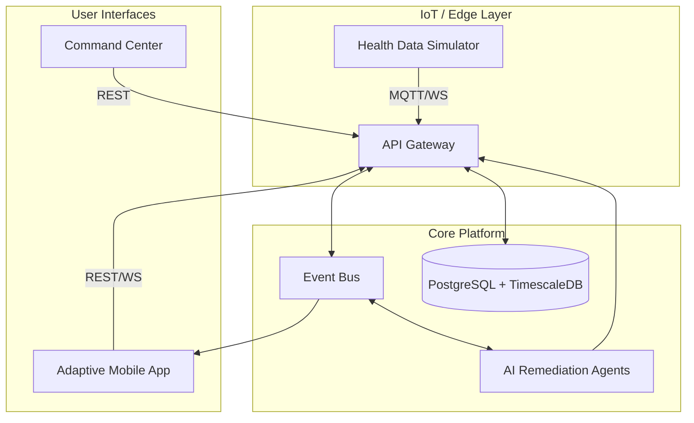

# AURA ONE


**The Operating System for the Future Hospital.**

AURA ONE is a unified platform that transforms static hospital environments into intelligent, responsive ecosystems. By integrating **Digital Twins**, **Real-Time IoT**, and **AI Agents**, it creates a seamless bridge between patient care, clinical operations, and administrative oversight.

---

## 🚀 Why AURA ONE?

Modern healthcare software is fragmented. Doctors use EMRs, nurses use paging systems, and patients are left in the dark. AURA ONE unifies these disconnected threads into a single "Operating System":

- **For Patients**: A transparent window into their recovery, with real-time health data and AI-guided understanding.
- **For Clinicians**: A context-aware command center that prioritizes tasks by urgency and risk, not just checklists.
- **For Administrators**: A bird's-eye view of hospital operations, from bed occupancy to emergency response times.

---

## 🏗️ System Architecture

The platform handles the full data lifecycle: **Ingestion** (simulated hardware), **Processing** (NestJS backend), and **Presentation** (Flutter/React clients).



---

## ⚡ Key Updates & Innovations

### 🧠 Intelligent Nurse Dashboard (**New**)

We've moved beyond static task lists. The new Nurse Module uses a **Priority Queue Algorithm** to sort care tasks based on:

1.  **Patient Acuity Score** (Real-time vitals analysis)
2.  **Task Time Sensitivity** (e.g., Medication windows)
3.  **Emergency Status** (Active alerts)

### 💬 Clinical Chat System v2

A complete rewrite of the messaging infrastructure:

- **Context-Aware**: Messages are linked to specific patient snapshots.
- **Resilient**: Guaranteed delivery with offline syncing.
- **Secure**: End-to-end encryption capable architecture.

### 🚨 100% Reliability Emergency Protocol

Critical alerts (e.g., "Cardiac Arrest") now bypass standard message queues, utilizing a dedicated WebSocket channel with distinct "High-Priority" flags to ensure immediate delivery to all active staff devices, regardless of network congestion.

---

## 📂 Tech Stack

| Component   | Technologies                                     |
| :---------- | :----------------------------------------------- |
| **Backend** | **NestJS**, Prisma, Socket.IO, PostgreSQL, Redis |
| **Mobile**  | **Flutter**, Riverpod, GoRouter                  |
| **Web**     | **React 19**, Vite, Tailwind CSS                 |
| **AI/ML**   | **Llama 3** (via Groq), n8n Workflows            |
| **DevOps**  | Docker, GitHub Actions                           |

---

## 🚀 Getting Started

### Prerequisites

- Node.js v18+
- Flutter SDK v3.x
- Docker Desktop

### 1. Infrastructure (Database)

Spin up the persistence layer:

```bash
docker-compose up -d
```

### 2. Backend Service

Initialize the API Gateway and Event Hub:

```bash
cd server
npm install
npx prisma db push   # Sync Schema
npm run start:dev    # Listen on :3001
```

### 3. Hardware Simulator

Launch the virtual medical monitor:

```bash
cd health_data
flutter run
```

### 4. Patient/Staff App

Launch the main interface:

```bash
cd mobile
flutter run
```

---

## 🔐 Credentials

| Role        | Email              | Password      | Access Level           |
| :---------- | :----------------- | :------------ | :--------------------- |
| **Doctor**  | `doctor@aura.com`  | `password123` | Full Clinical Access   |
| **Nurse**   | `nurse@aura.com`   | `password123` | Care & Ward Management |
| **Patient** | `patient@aura.com` | `password123` | Personal Health Record |
| **Family**  | `family@aura.com`  | `family123`   | Read-Only Monitor      |

---

## 🤝 Community & Support

- **Issues**: Please file bug reports using our [Issue Template](.github/ISSUE_TEMPLATE).
- **Discussions**: Join the conversation in [Discussions](.github/discussions).

---

_Maintained by the AURA ONE Engineering Team_
