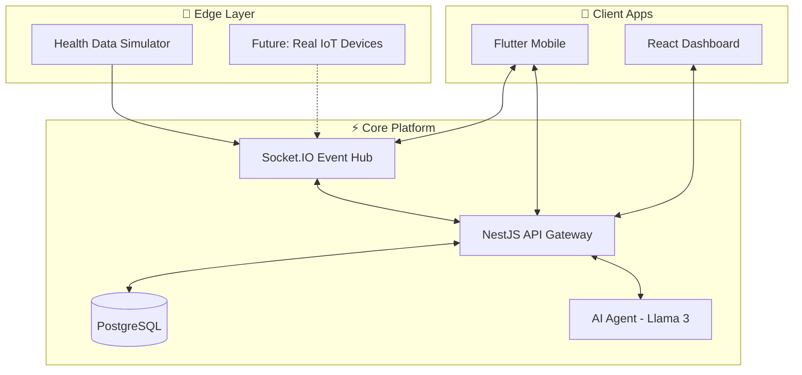

<p align="center">
  
</p>

<h1 align="center">AURA ONE</h1>
<h3 align="center">The Intelligent Operating System for Modern Hospitals</h3>

<p align="center">
  
  
  
  
</p>

<p align="center">
  <strong>Real-Time Vitals</strong> • <strong>Digital Twins</strong> • <strong>AI-Powered Care</strong> • <strong>Zero-Trust Security</strong>
</p>

---

## 🎯 The Vision

Modern healthcare is fragmented. Doctors use EMRs, nurses rely on pagers, and patients are left anxious and uninformed. **AURA ONE** unifies these disconnected experiences into a single, intelligent platform.

| Stakeholder    | Before AURA ONE                         | After AURA ONE                    |
| -------------- | --------------------------------------- | --------------------------------- |
| 🧑‍⚕️ **Doctor**  | Juggling 5 apps, missing alerts         | One dashboard, prioritized alerts |
| 👩‍⚕️ **Nurse**   | Paper checklists, manual prioritization | AI-sorted task queue by urgency   |
| 🛏️ **Patient** | Confused, anxious waiting               | Real-time health visibility       |
| 👨‍👩‍👧 **Family**  | No updates, constant calls              | Live status feed on phone         |

---

## 🏗️ Architecture Overview



---

## 🚀 Quick Start

### Prerequisites

```bash
✓ Node.js 18+
✓ Flutter 3.10+
✓ Docker Desktop
```

### One-Line Setup (Development)

```bash
# 1️⃣ Start Database
docker-compose up -d

# 2️⃣ Start Server
cd server && npm install && npx prisma db push && npm run start:dev

# 3️⃣ Start Mobile App (new terminal)
cd mobile && flutter run

# 4️⃣ Start Simulator (new terminal)
cd health_data && flutter run
```

---

## 📦 Project Structure

| Directory                       | Purpose                          | Tech Stack                |
| ------------------------------- | -------------------------------- | ------------------------- |
| [`/server`](./server)           | Backend API & Real-time Hub      | NestJS, Prisma, Socket.IO |
| [`/mobile`](./mobile)           | Cross-platform Patient/Staff App | Flutter, Riverpod         |
| [`/health_data`](./health_data) | Hardware Simulator               | Flutter                   |
| `/web`                          | Admin Dashboard                  | React, Vite               |

---

## 🛡️ Security Highlights

<table>
<tr>
<td width="50%">

### 🔐 Encryption

- **AES-256-GCM** for data at rest
- **TLS 1.3** ready architecture
- Per-record unique IVs

</td>
<td width="50%">

### 🔍 Compliance

- **HIPAA-ready** audit trails
- Immutable access logs
- Granular consent management

</td>
</tr>
<tr>
<td>

### 🚦 Access Control

- **Zero-Trust** authentication
- Role-based permissions (RBAC)
- Relationship-based data access

</td>
<td>

### ⚡ Resilience

- Rate limiting (10 req/min)
- JWT token validation
- Input sanitization

</td>
</tr>
</table>

---

## 🔑 Demo Credentials

| Role       | Email              | Password      |
| ---------- | ------------------ | ------------- |
| 👨‍⚕️ Doctor  | `doctor@aura.com`  | `password123` |
| 👩‍⚕️ Nurse   | `nurse@aura.com`   | `password123` |
| 🛏️ Patient | `patient@aura.com` | `password123` |
| 👨‍👩‍👧 Family  | `family@aura.com`  | `family123`   |

---

## ✨ Key Features

### 📊 Real-Time Vitals Streaming

Sub-100ms latency from sensor to screen. ECG waveforms render at 30Hz with gradient fills.

### 🧠 Intelligent Nurse Dashboard

AI-prioritized task queue sorted by patient acuity, medication schedules, and emergency status.

### 🚨 Emergency Protocol

Dedicated high-priority WebSocket channel ensures critical alerts bypass standard queues.

### 💬 Clinical Chat

End-to-end encrypted messaging with message persistence and offline sync.

### 🗺️ Indoor Navigation

A\* pathfinding algorithm for turn-by-turn hospital wayfinding.

---

<p align="center">
  <strong>Built with ❤️ by the AURA ONE Team</strong>
</p>
