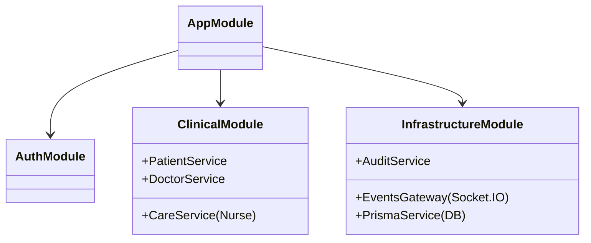

# AURA ONE Backend Engineering Guide


The **AURA ONE Backend** is a high-performance, event-driven system designed to handle the critical concurrency requirements of a hospital environment. It serves as the authoritative source of truth for patient data, clinical logic, and real-time coordination.

---

## 📐 System Design Principles

### 1. Event-Driven Core

Unlike traditional CRUD apps, a hospital OS must react instantly. We utilize an **Event Sourcing pattern** for critical vitals:

- Incoming telemetry from `health_data` is ingested via WebSockets.
- Events are immediately broadcast to subscribed clients (Doctors/Nurses).
- Data is asynchronously persisted to Time-Series storage (PostgreSQL) to prevent I/O blocking.

### 2. Security by Design

Privacy is not an add-on. We implement a **Zero-Trust** security model:

- **Granular Consent**: Data access is governed by the `ConsentModule`, checking relationships (e.g., "Is this Doctor assigned to this Patient?") before every read.
- **Audit Logging**: Every sensitive action (Read Vitals, Update Meds) is immutably logged via the `AuditModule` for HIPAA compliance.

### 3. Modular Monolith

To balance development speed with maintainability, we organize code by **Domain Modules** (Patient, Doctor, Care). This allows strict encapsulation of business logic while sharing core infrastructure (Auth, Database).

---

## 🏗️ Module Architecture



---

## 🔌 API & Event Catalog

### Real-Time Events (Socket.IO)

| Event Name          | Direction         | Payload                | Description                                 |
| :------------------ | :---------------- | :--------------------- | :------------------------------------------ |
| `simulate_vitals`   | **Inbound**       | `{ hr, spo2, ecg... }` | High-frequency sensor stream from hardware. |
| `patient.emergency` | **Inbound**       | `{ severity, type }`   | Critical alert trigger from edge devices.   |
| `vitals.update`     | **Outbound**      | `{ hr, spo2, bp... }`  | Normalized data broadcast to dashboard UIs. |
| `chat.message`      | **Bidirectional** | `{ content, sender }`  | End-to-end encrypted clinical messaging.    |

### REST Endpoints (Key Surfaces)

> **Authentication**: All endpoints require `Bearer <JWT_TOKEN>` header.

- **Identity**: `GET /auth/me` - Hydrates full user profile (Roles + Metadata).
- **Clinical**: `GET /care/ward` - Fetches prioritized task list for Nurses.
- **History**: `GET /patients/:id/history` - Aggregates EMR data timeline.

---

## 🔐 Configuration & Environment

The system relies on strict environment validation at startup.

```env
# Infrastructure
DATABASE_URL="postgresql://..."
REDIS_URL="redis://..."

# Keys
JWT_SECRET="<256-bit-secret>"
ENCRYPTION_KEY="<32-byte-hex-string>"

# Feature Flags
ENABLE_AI_AGENTS="true"
ENABLE_AUDIT_LOG="true"
```

## 🧪 Testing & Validation

We enforce strict quality gates:

- **Unit Tests**: `npm run test` - Business logic validation.
- **E2E Tests**: `npm run test:e2e` - Full API flow verification.

---

_Engineering Docs v1.2_
